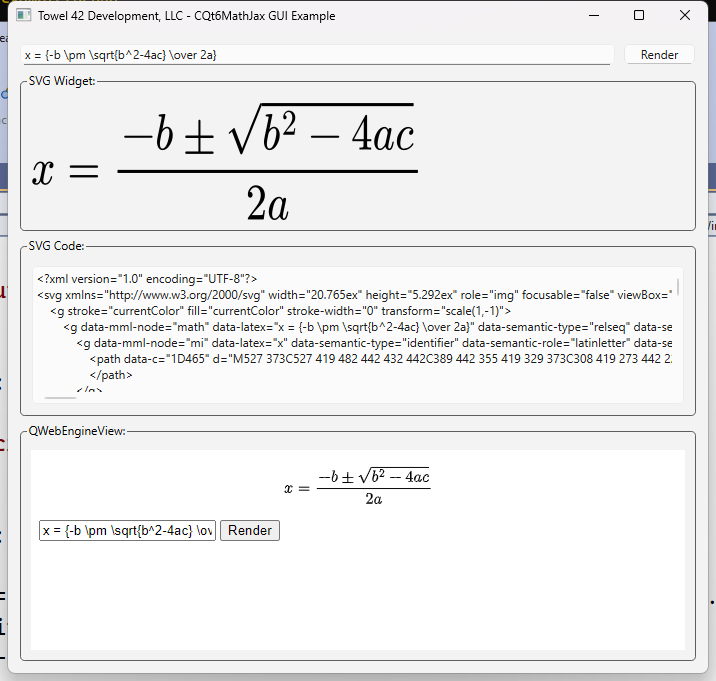

# Overview

*QtMathJax* is a `cmake` based `Qt 6` library that allows you to easily add
math typesetting into any [Qt] application.

It is based on the work previously done (and forked from) 
https://github.com/nathancarter/qtmathjax.

[MathJax] is the de facto standard for mathematical typesetting on
the web, using a JavaScript-based typesetting engine.
*QtMathJax* imports the latest version (4.0) from https://github.com/mathjax/MathJax
as a submodule.  **Note** currently the internal mechanism uses
the public https://cdn.jsdelivr.net/npm/mathjax@4 *MathJax* system rather
than using the local version.  This is necessary as there appears to be a 
bug in the chromium or node.js back-end in Qt.

The library loads the *MathJax* library via a hidden `QWebEngineView` and provides
a single API call for converting TeX code into an SVG file which can be used in any
image viewer, including [QSvgWidget].  There are both synchronous and asynchronous API calls.
You make the call via a method (or signal) and are notified when rendering is completed.

# Obtaining

Just clone this git repo, or use it as a [submodule] in your
project.  In fact, it uses [MathJax] as a [submodule] itself.

It also has a dependency on [T42-CMakeUtils] a project which contains 
a ton of [CMake] utilities.

# Usage (Asynchronous)

To use *QtMathJax*, follow these steps.

1. In your top level `CMakeLists.txt` file import *QtMathJax* by adding the following
   line.
   ```
   add_submodule(/path/to/T42-Qt6MathJax)
   
   ```
   This step will also update your C++ include path
2. In the source file where you need to use it, include the one
   class you need, `NTowel42::CQt6MathJax`, via `#include "Qt6MathJax.h"`.
3. Create an instance of the class, connect to the signals you need (`CQt6MathJax::sigSVGRendered is required`)
    and call the `renderSVG( const QString & texCode )` method.

```
NTowel42::CQt6MathJax renderer;  
QByteArray svgData;
connect( &renderer, &NTowel42::CQt6MathJax::sigErrorMessage,
    [=]( const QString & msg )
    {
        qDebug() << msg;
    } );
connect( &renderer, &NTowel42::CQt6MathJax::sigSVGRendered,
    [=]( const QByteArray & svg )
    {
        svgData = svg;
    } );
    
auto svg = renderer.renderSVG( "ax^2+bx+c=0" );
```

**NOT** this call is asynchonous, The call to `renderSVG` will return immediately.  The variable 
`svgData` must still be in scope when the call finishes.  It is recommended that in `QGuiApplication` 
or `QApplication` based executables, that the signal is connected to a class that can handle the parameter more effectively.
See the `GUI-Example` example app.

You can now render that SVG in any of
`the ways Qt provides`[QtSVG], or save it to a file.  Example:

```
myQSvgWidget->load( svgCode );
```

You can call call for multiple renderings if your system requires it, the SVG data will be returned
in order of their requested rendering.

# Usage (Synchronous)

There is also an API for synchronous rendering.  You call 
```renderer.renderSVG( const QString &texCode, std::function< void( const std::optional< QByteArray > & svg ) > )```
and the blocking call will execute and when finished call the lambda sent in.

If there was an error, svg will not have a value.

# Dependencies
The following [Qt] Libraries must be added as dependencies to your application:
* [QtCore]
* [QtWidgets]
* [QtWebEngineWidgets]

**NOTE** A project is being worked on to remove the WebEngineWidgets dependency and use a node.js engine from
the [QML] [Qt] module.

# Examples

The repository comes with a 2 sample applications in the [example] subfolder.

The first [example-cli] is a command line application that uses the synchronous 
call to produce a svg file based on the command line parameters.

The second [example-gui] is a [QDialog] based application that uses the asynchonous API to
render the SVG into a widget on the dialog.  

If using Qt 6, you should be able to compile and run that app
without any changes needed.  It looks like this:



# License

This project is released under the [MIT] licensing.
It is my understanding that this is compatible with the
[Apache license] under which [MathJax] is released.

[T42-CMakeUtils]:     https://github.com/towel42-com/T42-CMakeUtils
[Qt]:                 http://qt-project.org
[QtCore]:             https://doc.qt.io/qt-6/qtcore-index.html
[QtWidgets]:          https://doc.qt.io/qt-6/qtwidgets-index.html
[QtWebEngineWidgets]: https://doc.qt.io/qt-6/qtwebenginewidgets-index.html
[QtSVG]:              https://doc.qt.io/qt-6/qtsvg-index.html
[QSvgWidget]:         https://doc.qt.io/qt-6/qsvgwidget.html
[QDialog]:            https://doc.qt.io/qt-6/qdialog.html
[CMake]: http://cmake.org
[MathJax]: http://mathjax.org
[submodule]: http://schacon.github.io/git/user-manual.html#submodules
[example]: ./example/
[example-cli]: ./example/cli
[example-gui]: ./example/gui
[MIT]: https://opensource.org/license/mit
[Apache license]: https://github.com/mathjax/MathJax/blob/master/LICENSE

